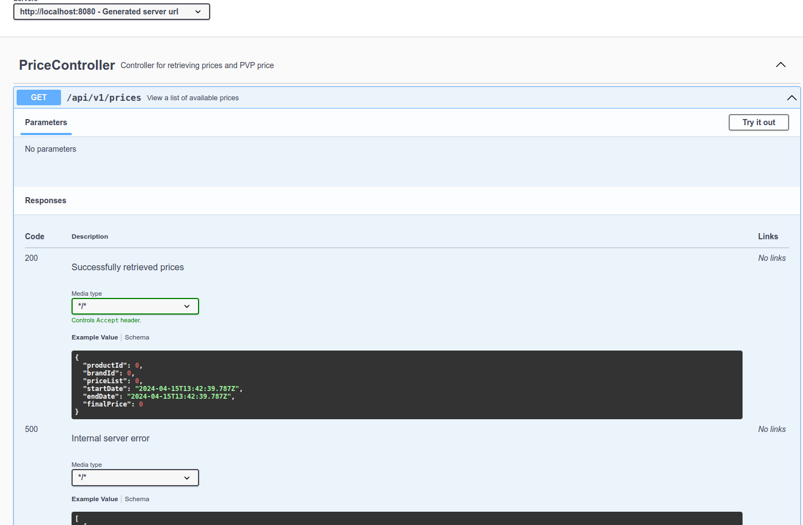
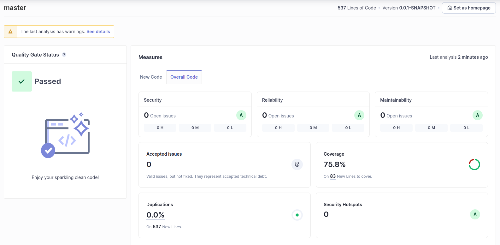
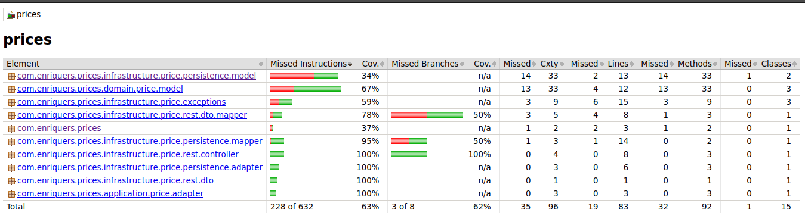

# Planteamiento Inicial

La Arquitectura elegida es una arquitectura hexagonal, con una capa de dominio, que es el core de la
aplicación, una capa de infraestructura y una capa de aplicación.
El dominio es el núcleo de nuestro sistema, por lo que no debe depender de ninguna otra capa.
La forma de comunicación entre las capas es mediante interfaces (ports), de esta forma se puede
cambiar la implementación de una capa sin afectar a las demás.

Esta arquitectura también se conoce como puertos y adaptadores. A grandes rasgos, los puertos serían
las interfaces que definen la comunicación entre las capas y los adaptadores serían las
implementaciones de esas interfaces según el contexto en el que se consuma.
La misión de la capa de aplicación es orquestar las llamadas a los servicios y la capa de
infraestructura es la encargada de la comunicación con el exterior.
Por último, la capa de infraestructura es la encargada de la comunicación con el exterior (APIs,
base de datos, interfaces gráficas...)

Implementando esta arquitectura, se consigue un sistema más escalable, mantenible y testeable.
También nos aseguramos de respetar los principios SOLID.

## Principios SOLID

### **S**

Principio de responsabilidad única cada una de las capas tiene una responsabilidad única bien
definida lo cual evita mezclar responsabilidades y facilitar el mantenimiento del código.

### **O**

Principio de abierto cerrado las entidades y casos de uso están abiertos a extensión pero cerrados a
modificación si se necesita agregar una nueva funcionalidad lo que podemos hacer es extender los
casos de uso creando nuevos adaptadores.

### **L**

Principio de sustitución de Liskov la cual nos dice que los adaptadores y las implementaciones de
los puertos deben ser sustituibles sin afectar el comportamiento del sistema.

### **I**

Principio de segregación de interfaces las interfaces deben ser específicas para cada caso de uso.

### **D**

Principio de inversión de dependencias las capas internas no dependen de las capas externas.

## Descarga y ejecución

Para descargar el proyecto, se debe ejecutar el siguiente comando:

```bash
git clone git@github.com:EnriqueRS/prices.git
```

Para ejecutar el proyecto, se debe ejecutar el siguiente comando:

```bash
mvn spring-boot:run
```

## Tecnologías usadas

- Java 17
- Spring Boot 3
- Maven
- Lombok (para reducir el código mediante anotaciones)
- Sonar (para el análisis estático del código)
- Docker (para la creación de la imagen)
- Swagger (para la documentación de la API con OpenAPI)
- Junit Jupiter (JUnit 5) para los tests

## Docker

Para ejecutar la aplicación en un contenedor de docker, se debe ejecutar el siguiente comando:

```bash
 docker build -t prices .
```

```bash
docker run -p 8080:8080 prices
```

## Tests

Se han creado tests unitarios y de integración. En los tests unitarios no se carga el contexto
completo de la aplicación. En los
tests de integración se carga el contexto de la aplicación y se realizan pruebas sobre los
endpoints que expone la aplicación.

## Swagger

Se ha añadido la documentación de la API con OpenAPI. Para acceder a ella, se debe ir a la siguiente
URL:

```bash
http://localhost:8080/swagger-ui.html
```



## SonarQube

Se ha usado SonarQube para el análisis del código. Se levanta una instancia de SonarQube en un
contenedor de Docker con el siguiente comando:

```bash
docker run -d --name sonarqube -p 9000:9000 sonarqube:latest
```

Para realizar el análisis desde maven, se debe ejecutar el siguiente comando:

```bash
 mvn clean verify sonar:sonar \
  -Dsonar.projectKey=prices-project \
  -Dsonar.projectName='Prices Project' \
  -Dsonar.host.url=http://localhost:9000 \
  -Dsonar.token={token}
```

Se adjunta el análisis:


## Cobertura de tests

Se adjunta la cobertura de tests, generado mediante Jacoco.:

